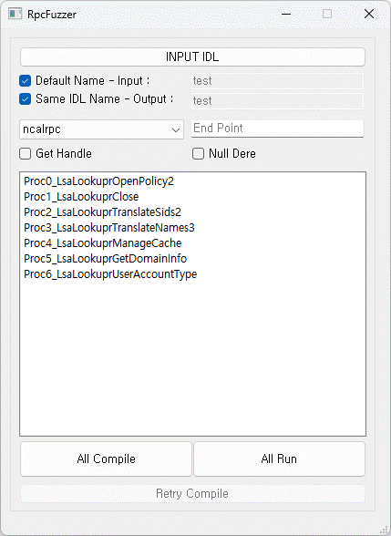

<div align='center'>
  <h1><code>RpcFuzzer (BoB13-MSRC_GASAN)</code></h1>
  <p>
    <strong>A tool that fuzzes the method of the Rpc Interface. It operates by receiving an IDL file that is automatically saved from the improved RpcView as input.</strong>
  </p>
  <p>
    <strong>It also automatically generates the Rpc Client code.</strong>
  </p>
  <p align='center'>
  
  </p>
</div>

## Overview

The RpcFuzzer automatically generates and compiles the client code that calls the desired method, and generates the code to fuzz for a specific data type.

It can be useful for those who conduct vulnerability analysis on a wide range of targets using Rpc protocol.

In particular, it is good to quickly explore because the Rpc interface is diverse and there are many methods for each interface.

## The Rpc approach

Here's how to find the Rpc interface and method:
- Use RpcView, which we have improved (https://github.com/BoB13-MSRC-GS/RpcView)
- Use RpcView (https://github.com/silverf0x/RpcView)
- User findrpc (https://github.com/lucasg/findrpc)

**IDL is extracted by decompiling the Rpc Interface using the above tools.**

## Compilation

Required elements to compiled:
- Visual Studio 2022
- Visual Studio Code
- Python 3.9.12

Create a python virtual environment:
```cmd
python -m venv VirtualEnv
```

Installation of required components:
```cmd
pip install -r requirement.txt
```

Run python script, or Compile using pyinstaller:
```cmd
python RpcFuzzer.py
```
```cmd
pyinstaller -w -F --add-data="sfiles/*;./" RpcFuzzer.py
```

## Using RpcFuzzer

1. Add the midl.exe and cl.exe installation directories included when you install Visual Studio to the **system environment variables**.

2. Correct the Developer Command Prompt path in the **config.ini** file.

3. Import the IDL File through the ```INPUT IDL``` button in the RpcFuzzer.

```
Example:
  C:\Dev\lsass.idl

--------------------------------------------------------------------------------------------------------------------------------------------

[
	uuid(fb8a0729-2d04-4658-be93-27b4ad553fac),
	version(1.0),
]
interface DefaultIfName
{

	typedef struct Struct_28_t
	{
		short 	StructMember0;
		short 	StructMember1;
		[unique] /* [DBG] FC_CVARRAY */[size_is(StructMember1)][length_is(StructMember0)]char *	StructMember2/*[] CONFORMANT_ARRAY*/;
	}Struct_28_t;

	typedef struct Struct_52_t
	{
		char 	StructMember0[6];
	}Struct_52_t;

	typedef struct Struct_74_t
	{
		char 	StructMember0;
		char 	StructMember1;
		struct Struct_52_t 	StructMember2;
	[size_is(StructMember1)]long StructMember3[];
		}Struct_74_t;

	typedef struct Struct_100_t
	{
		char 	StructMember0;
		char 	StructMember1;
		short 	StructMember2;
	[size_is(/* FC_EXPR */(StructMember2 - 4))]char StructMember3[];
		}Struct_100_t;

	typedef struct Struct_110_t
	{
		char 	StructMember0;
		char 	StructMember1;
		short 	StructMember2;
		[unique]struct Struct_74_t* 	StructMember3;
		[unique]struct Struct_74_t* 	StructMember4;
		[unique]struct Struct_100_t* 	StructMember5;
		[unique]struct Struct_100_t* 	StructMember6;
	}Struct_110_t;

	typedef struct Struct_144_t
	{
		long 	StructMember0;
		/* enum_16 */ short 	StructMember1;
		char 	StructMember2;
		char 	StructMember3;
	}Struct_144_t;

	typedef struct Struct_158_t
	{
		long 	StructMember0;
		[unique]char *	StructMember1;
		[unique]struct Struct_28_t* 	StructMember2;
		long 	StructMember3;
		[unique]struct Struct_110_t* 	StructMember4;
		[unique]struct Struct_144_t* 	StructMember5;
	}Struct_158_t;

	typedef struct Struct_226_t
	{
		[unique]struct Struct_74_t* 	StructMember0;
	}Struct_226_t;

	typedef struct Struct_262_t
	{
		[range(0,20480)] long 	StructMember0;
		[unique] /* [DBG] FC_BOGUS_ARRAY */ [size_is(StructMember0)] /*  */ struct Struct_226_t* 	StructMember1;
	}Struct_262_t;

	typedef struct Struct_308_t
	{
		short 	StructMember0;
		short 	StructMember1;
		[unique] /* [DBG] FC_CVARRAY */[size_is(StructMember1/2)][length_is(StructMember0/2)]wchar_t *	StructMember2/*[] CONFORMANT_ARRAY*/;
	}Struct_308_t;

	typedef struct Struct_326_t
	{
		struct Struct_308_t 	StructMember0;
		[unique]struct Struct_74_t* 	StructMember1;
	}Struct_326_t;

	typedef struct Struct_366_t
	{
		long 	StructMember0;
		[unique] /* [DBG] FC_BOGUS_ARRAY */ [size_is(StructMember0)] /*  */ struct Struct_326_t* 	StructMember1;
		long 	StructMember2;
	}Struct_366_t;

	typedef struct Struct_398_t
	{
		/* enum_16 */ short 	StructMember0;
		struct Struct_308_t 	StructMember1;
		long 	StructMember2;
		long 	StructMember3;
	}Struct_398_t;

	typedef struct Struct_438_t
	{
		[range(0,20480)] long 	StructMember0;
		[unique] /* [DBG] FC_BOGUS_ARRAY */ [size_is(StructMember0)] /*  */ struct Struct_398_t* 	StructMember1;
	}Struct_438_t;

	typedef struct Struct_524_t
	{
		/* enum_16 */ short 	StructMember0;
		[unique]struct Struct_74_t* 	StructMember1;
		long 	StructMember2;
		long 	StructMember3;
	}Struct_524_t;

	typedef struct Struct_564_t
	{
		[range(0,1000)] long 	StructMember0;
		[unique] /* [DBG] FC_BOGUS_ARRAY */ [size_is(StructMember0)] /*  */ struct Struct_524_t* 	StructMember1;
	}Struct_564_t;

	typedef [switch_type(/* enum_16 */ short )] union union_606
	{
		[case(0)]	struct Struct_692_t unionMember_0;
		[case(1)]	struct Struct_716_t unionMember_1;
		[case(2)]	struct Struct_766_t unionMember_2;
	/* no default member to print for this Union.
	An exception will be raised if the switch_is value does not match any of the cases values */
	} union_606;


	typedef struct Struct_648_t
	{
		short 	StructMember0;
		short 	StructMember1;
		[unique] /* [DBG] FC_CVARRAY */[size_is(StructMember1/2)][length_is(StructMember0/2)]short *	StructMember2/*[] CONFORMANT_ARRAY*/;
	}Struct_648_t;

	typedef struct Struct_678_t
	{
		char 	StructMember0;
		char 	StructMember1;
		struct Struct_52_t 	StructMember2;
	[size_is(StructMember1)]long StructMember3[];
		}Struct_678_t;

	typedef struct Struct_692_t
	{
		struct Struct_648_t 	StructMember0;
		struct Struct_648_t 	StructMember1;
		[ref]struct Struct_678_t* 	StructMember2;
		long 	StructMember3;
	}Struct_692_t;

	typedef struct Struct_716_t
	{
		struct Struct_648_t 	StructMember0;
		struct Struct_648_t 	StructMember1;
	}Struct_716_t;

	typedef struct Struct_766_t
	{
		[range(1,4096)] long 	StructMember0;
		[ref] /* [DBG] FC_BOGUS_ARRAY */ [size_is(StructMember0)] /*  */ struct Struct_692_t* 	StructMember1;
	}Struct_766_t;

	typedef [switch_type(/* enum_16 */ short )] union union_804
	{
		[case(0)]	struct Struct_828_t unionMember_0;
		[case(1)]	struct Struct_828_t unionMember_1;
		[case(2)]	struct Struct_828_t unionMember_2;
	/* no default member to print for this Union.
	An exception will be raised if the switch_is value does not match any of the cases values */
	} union_804;


	typedef struct Struct_828_t
	{
		/* enum_16 */ short 	StructMember0;
	}Struct_828_t;

	typedef [switch_type(/* enum_16 */ short )] union union_860
	{
		[case(5)]	struct Struct_878_t unionMember_5;
		[case(12)]	struct Struct_914_t unionMember_12;
	/* no default member to print for this Union.
	An exception will be raised if the switch_is value does not match any of the cases values */
	} union_860;


	typedef struct Struct_878_t
	{
		struct Struct_308_t 	StructMember0;
		[unique]struct Struct_74_t* 	StructMember1;
	}Struct_878_t;

	typedef struct Struct_902_t
	{
		long 	StructMember0;
		short 	StructMember1;
		short 	StructMember2;
		byte 	StructMember3[8];
	}Struct_902_t;

	typedef struct Struct_914_t
	{
		struct Struct_308_t 	StructMember0;
		struct Struct_308_t 	StructMember1;
		struct Struct_308_t 	StructMember2;
		struct Struct_902_t 	StructMember3;
		[unique]struct Struct_74_t* 	StructMember4;
	}Struct_914_t;

	long Proc0_LsaLookuprOpenPolicy2(
	[in][unique][string] wchar_t* arg_0, 
	[in]struct Struct_158_t* arg_1, 
	[in]long arg_2, 
	[out][context_handle] void** arg_3
);


	long Proc1_LsaLookuprClose(
	[in][out][context_handle] void** arg_0
);


	long Proc2_LsaLookuprTranslateSids2(
	[in][context_handle] void* arg_0, 
	[in]struct Struct_262_t* arg_1, 
	[out][ref]struct Struct_366_t** arg_2, 
	[in][out]struct Struct_438_t* arg_3, 
	[in][out]long *arg_4, 
	[in]long arg_5, 
	[in]long arg_6
);


	long Proc3_LsaLookuprTranslateNames3(
	[in][context_handle] void* arg_0, 
	[in][range(0,1000)] long arg_1, 
	[in] /* [DBG] FC_BOGUS_ARRAY */ [size_is(arg_1)] /*  */ struct Struct_308_t* arg_2, 
	[out][ref]struct Struct_366_t** arg_3, 
	[in][out]struct Struct_564_t* arg_4, 
	[in][out]long *arg_5, 
	[in]long arg_6, 
	[in]long arg_7
);


	long Proc4_LsaLookuprManageCache(
	[in][unique][string] wchar_t* arg_0, 
	[in]/* enum_16 */ short arg_1, 
	[in][switch_is(arg_1)]union union_606* arg_2, 
	[out][ref][switch_is(arg_1)]union union_804** arg_3
);


	long Proc5_LsaLookuprGetDomainInfo(
	[in][context_handle] void* arg_0, 
	[in]/* enum_16 */ short arg_1, 
	[out][ref][switch_is(arg_1)]union union_860** arg_2
);


	long Proc6_LsaLookuprUserAccountType(
	[in][unique][string] wchar_t* arg_0, 
	[in][unique]struct Struct_74_t* arg_1, 
	[out][ref]/* enum_16 */ short *arg_2
);

} 
```
4. Specify the **protocol method (ncalrpc, ncacn_np, etc...)** and the **End Point** of the Rpc Server. (Leave the End Point blank if it is registered.)

5. Now double-click the method you want, or click the ```All Compile``` button. To generate the source code and executable file that call the method.

6. If necessary, modify the get_handle.cpp file in the directory to manually fit the call sequence according to the Rpc methods. This will be added when the code is automatically generated.

7. If a compilation error occurs, correct the cpp file directly generated by the RpcFuzzer and press ```Retry Compile``` button. Since this is not the ChatGPT, automatic generation of Rpc Client code cannot be perfect.

